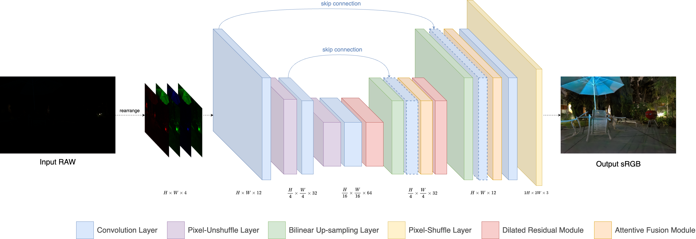

# Real-time Attentive Dilated U-Net for Extremely Dark Image Enhancement

This repo hosts the official implementation of _[TOMM 2024 paper](https://doi.org/10.1145/3654668), "Real-time Attentive Dilated U-Net for Extremely Dark Image Enhancement"_.

## Architecture



## Prerequisite

* Python >= 3.9
* PyTorch >= 1.0
* Nvidia GPU + CUDA

## Installation

Install dependencies:

```sh
pip install -r requirements.txt
```

## Usage

### Data Preparation

Download the [SID dataset](https://github.com/cchen156/Learning-to-See-in-the-Dark) and create a symlink `SID` to it under the `dataset` folder:
```sh
ln -s your/path/to/SID ./dataset/SID
```

After that, your directory structure should resemble the following:
```
|-- dataset
    |-- SID
        |-- Sony
            |-- long
            |-- short
        |-- Fuji
            |-- long
            |-- short
|-- ...
```

### Training

To train new models from scratch:

```sh
# train on the SID-Sony subset (Bayer CFA)
python main.py --data_path ./dataset/SID/Sony

# train on the SID-Fuji subset (X-Trans CFA)
python main.py --data_path ./dataset/SID/Fuji --cfa xtrans
```

> By default, the code will load all the preprocessed RAW images into memory. This takes about 47GB RAM for training on the Sony subset and 84GB RAM on the Fuji subset.

### Evaluation

To evaluate trained models:

```sh
# eval on the SID-Sony subset
python main.py --data_path ./dataset/SID/Sony --phase test --ckpt $CKPT

# eval on the SID-Fuji subset
python main.py --data_path ./dataset/SID/Fuji --phase test --ckpt $CKPT --cfa xtrans
```

### Benchmarking

We measure the model's MACs, number of params, inference time and memory consumption statistics using the following code. For more details, please refer to [flops_test.py](flops_test.py).

```sh
# 1. test cpu inference time
python flops_test.py --cpu

# 2. test gpu inference time
python flops_test.py

# 3. test gpu memory consumption
python flops_test.py --no_benchmark
```

### Object Detection

We provide scripts to evaluate object detection results on the enhanced images. Please refer to [detection/README.md](detection/README.md) for more details.

## Results and Pre-trained models

We provide the pre-trained models and visual results.

| Dataset | PSNR | SSIM | MAC(s) | #Params(M) | CPU/GPU <br/>Inference Time(s) | GPU <br/>Memory (GB) | Pre-trained Model | Visual Results |
| :---: | :---: | :---: | :---: | :---: | :---: | :---: | :---: | :---: |
| SID-Sony | 29.35 | 0.7877 | 0.19 | 0.635 | 1.1791 / 0.0367 | 0.79 | [ckpt](https://drive.google.com/file/d/1swpobU3z33pCnmHmhiByaImU96t6tE2G/view?usp=share_link) | [images](https://drive.google.com/drive/folders/1ieiDUey1ogp46fReR6O86GazdljUMr9z?usp=share_link) |
| SID-Fuji | 27.55 | 0.7118 | 0.23 | 0.637 | 1.1385 / 0.0342 | 0.88 | [ckpt](https://drive.google.com/file/d/1RMXcOiKe2TMQWUuVIXJ11yKm2ApkQOfN/view?usp=share_link) | [images](https://drive.google.com/drive/folders/1sh9yt2BvrFEKY9Xzeuec36vH4JF1pK2Y?usp=share_link) |

## Citation

If you find this repository useful, please consider citing:

```bibtex
@article{huang2024real,
  title={Real-time Attentive Dilated U-Net for Extremely Dark Image Enhancement},
  author={Huang, Junjian and Ren, Hao and Liu, Shulin and Liu, Yong and Lv, Chuanlu and Lu, Jiawen and Xie, Changyong and Lu, Hong},
  journal={ACM Transactions on Multimedia Computing, Communications and Applications},
  volume={20},
  number={8},
  pages={1--19},
  year={2024}
}
```